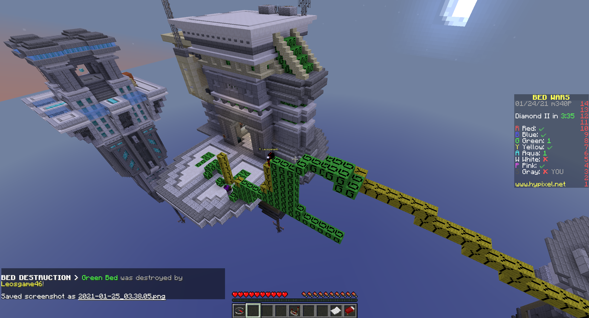
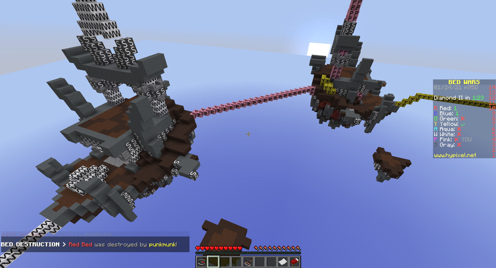

Resource Packs for Colorblind Bedwars
=====================================

Resource packs that add letters to the different colors of wool.
Currently there are 2 different packs with 2 different fonts:

Green base with a yellow bridge leading to it (mcfont based on in-game text):

 

White base, pink base, yellow bridge (sansfont):

 

## Instructions

1. Place respack folders in `$MINECRAFT_FOLDER/resourcepacks`
    - In Windows 10, this is under `%appdata%/.minecraft/resourcepacks`
    - Linux: `~/.minecraft/resourcepacks/`
    - macOS: `~/Library/Application\ Support/minecraft/resourcepacks`
2. Start Minecraft and select a pack under `Options > Resource Packs`
    (in vanilla, most other clients should have an option for it as well)

The letters are chosen in accordance with Hypixel (RBGYAWPS).
All of these are the first letter of the color except for gray
    which is S ("silver").
